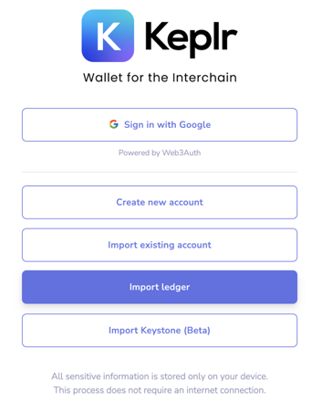

# Import an Account with a Ledger

1. In the initial pop-up window, choose **Import Ledger**

* If you have used Keplr before, click on the silhouette in the upper-right corner, then the blue box labeled **Add Account**, and select **Import Ledger**
* Be sure you have both the Cosmos and Ethereum Ledger apps downloaded on your Ledger device

2. To complete the connection with your Ledger device, follow the steps described in the pop-up that appears (a detailed tutorial can be found [here](https://medium.com/chainapsis/how-to-use-ledger-nano-hardware-wallet-with-keplr-9ea7f07826c2)) or another article from a [validator](https://medium.com/coinmonks/how-to-set-up-ledger-wallet-evmos-using-keplr-c438cf8c5321).
3. If you have not used Keplr before, set a **strong** password for the Keplr extension, and click **Confirm**

* All signing from Keplr will use the Ledger Ethereum app, with either [EIP-712 transactions](https://eips.ethereum.org/EIPS/eip-712) or standard [Ethereum transactions](https://ethereum.org/en/developers/docs/transactions/).
