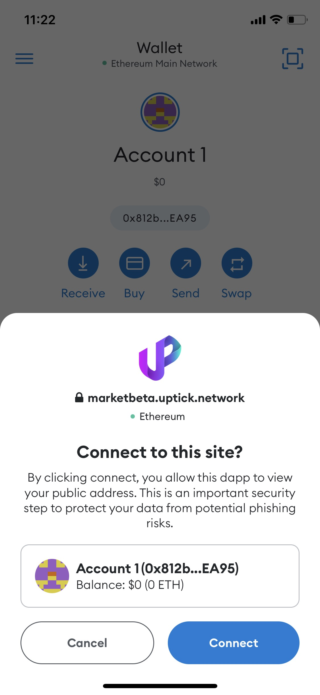

# WalletConnect

Open link [https://marketbeta.uptick.network/index](https://marketbeta.uptick.network/index) and click `Connect Wallet`, choose `WalletConnect`

.png>)

Open [UptickPro](https://marketbeta.uptick.network/downloads) or [MetamaskAPP](https://metamask.io/download/) to scan the QR code

Click `Approve`

When performing operations such as creating and selling, the corresponding pop-up window will be displayed for operation.
