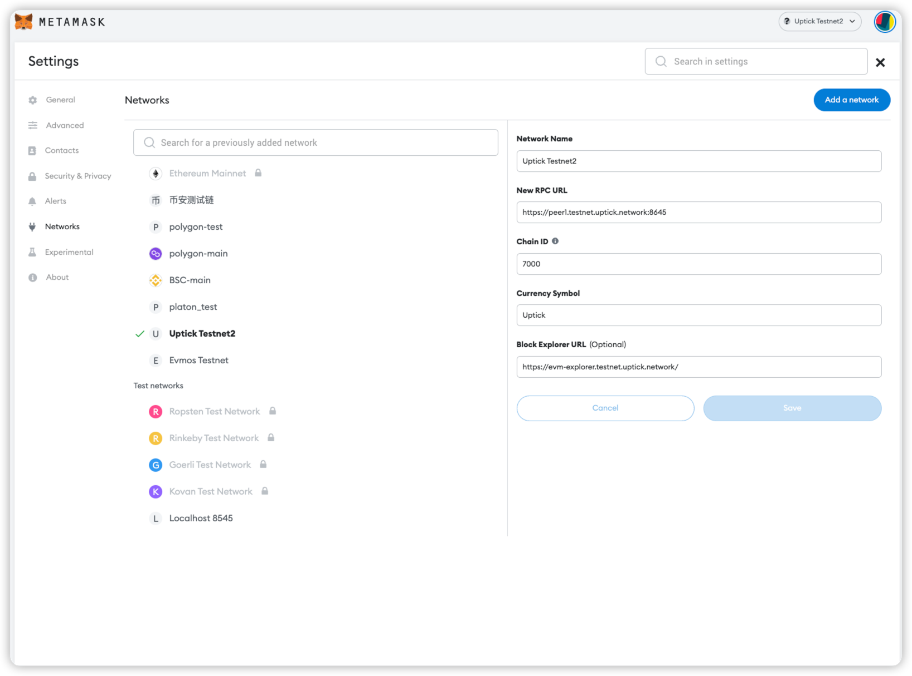
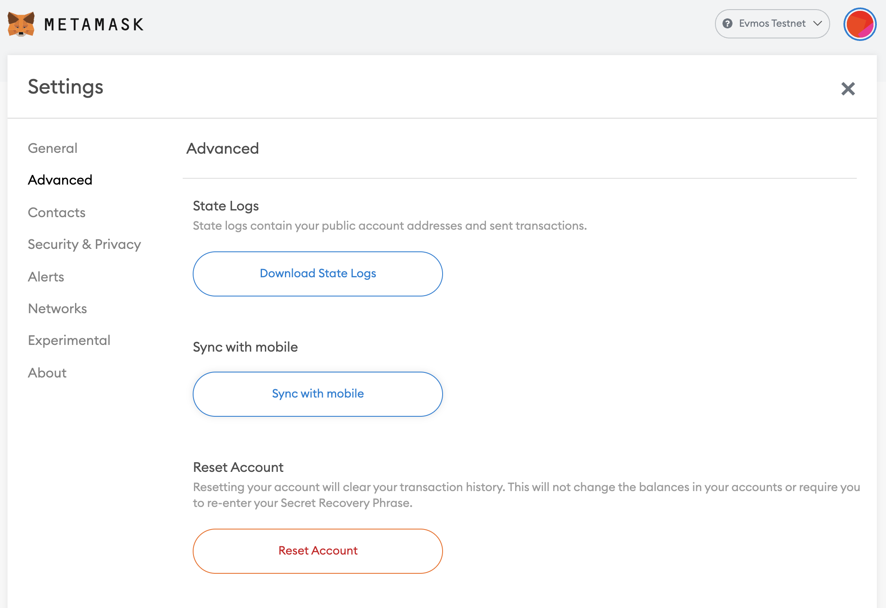

# MetaMask

Connect your MetaMask wallet with Uptick

The MetaMask browser extension is a wallet for accessing Ethereum-enabled applications and managing user identities. It can be used to connect to Uptick through the official testnet or via a locally-running Uptick node.


If you are planning on developing on Uptick locally and you haven’t already set up your own local node, refer to [the quickstart tutorial](../quickstart/README.md), or follow the instructions in the [GitHub repository](https://github.com/UptickNetwork/uptick/).


## Adding a New Network

Open the MetaMask extension on your browser, you may have to log in to your MetaMask account if you are not already. Then click the top right circle and go to `Settings` > `Networks` > `Add Network` and fill the form as shown below.


You can also lookup the [EIP155](https://github.com/ethereum/EIPs/blob/master/EIPS/eip-155.md) documentation page.




Here is the list of fields that you can use to paste on Metamask:

Testnet

* **Network Name:** `Uptick origin Testnet`
* **New RPC URL:** `https://jrpc-rpc.origin.uptick.network`
* **Chain ID:** `1170`
* **Currency Symbol (optional):** `UOC`
* **Block Explorer URL (optional):** `https://evm-explorer.origin.uptick.network`

## Import Account to Metamask

### Manual Import

Close the `Settings`, go to `My Accounts` (top right circle) and select `Import Account`. You should see an image like the following one:


Now you can export your private key from the terminal using the following command. Again, make sure to replace `mykey` with the name of the key that you want to export and use the correct `keyring-backend`:

```bash
uptickd keys unsafe-export-eth-key mykey --keyring-backend test
```

Go back to the browser and select the `Private Key` option. Then paste the private key exported from the `unsafe-export-eth-key` command.

Your account balance should show up as `1 UOC` and do transfers as usual.


If it takes some time to load the balance of the account, change the network to `Main Ethereum Network` (or any other than `Localhost 8545` or `Uptick`) and then switch back to `Uptick`.


## Reset Account

If you used your Metamask account for a legacy testnet/mainnet upgrade, you will need to reset your account in order to use it with the new network. This will clear your account's transaction history, but it won't change the balances in your accounts or require you to re-enter your `Secret Recovery Phrase`.

:


Make sure you download your [account state](metamask.md#download-account-state) to persist public account addresses and transactions before clearing your wallet accounts.


Go to `Settings` > `Advanced` and click the `Reset Account` button as shown below:



## Download Account State

To see your Metamask logs, click the top right circle and go to `Settings` > `Advanced` > `State Logs`. If you search through the JSON file for the account address you'll find the transaction history.
