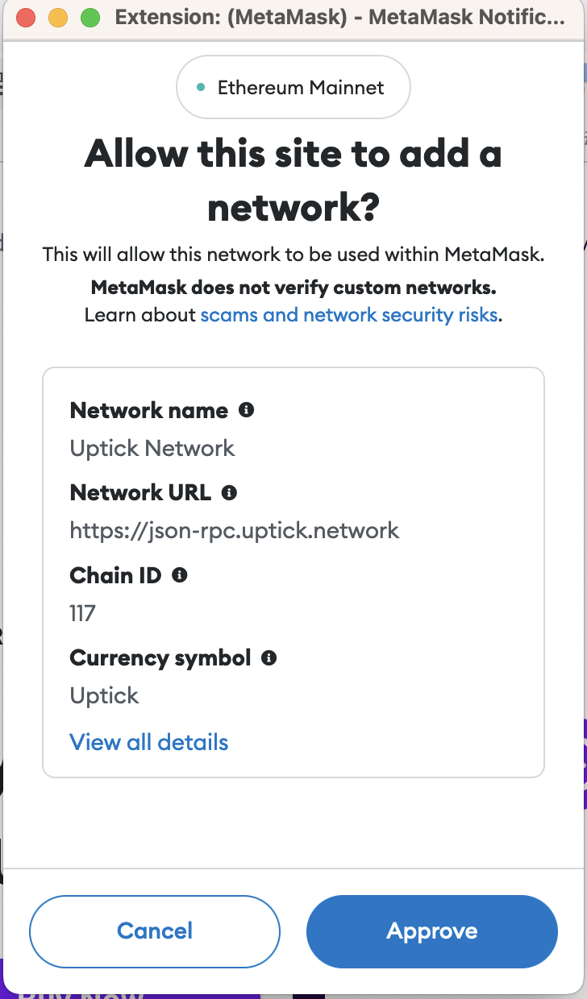

# Sign-In with Ethereum

You can set up [Sign-In with](https://docs.login.xyz/) Uptick network to enable users to easily sign in to your dapp  by authenticating with their MetaMask wallet.

MetaMask supports the SIWE standard message format as specified in [ERC-4361](https://eips.ethereum.org/EIPS/eip-4361). When your dapp prompts a user to sign a message that follows the SIWE format, MetaMask parses the message and gives the user a friendly interface prompting them to sign in to your dapp:

```
// Sign-in with Ethereum
export async function addNetwork() {
    try {
        await window.ethereum.request({
            method: 'wallet_addEthereumChain',
            params: [{
                chainId: `0x75`,
                chainName: `Uptick Network`,
                nativeCurrency: {
                    name: 'UptickToken',
                    symbol: `Uptick`, 
                    decimals: 18,
                },
                rpcUrls: [`https://json-rpc.uptick.network`],
                blockExplorerUrls: [`https://evm-explorer.uptick.network/`],
            }],
        });

   
    }
    catch (error) {
        console.error(error);
    }
}
```

Domain binding[​](https://docs.metamask.io/wallet/how-to/use-siwe/#domain-binding)

MetaMask supports domain binding with SIWE to help prevent phishing attacks. When a site asks a user to sign a SIWE message, but the domain in the message doesn't match the site the user is on, MetaMask displays a warning in the sign-in interface. The user must explicitly select to proceed, accepting the risk of a phishing attack.

IMPORTANT

MetaMask displays a prominent warning for mismatched domains, but does **not** block users from bypassing the warning and accepting the sign-in request. This is to not break existing dapps that may have use cases for mismatched domains.



.png>)

**Example**[​](https://docs.metamask.io/wallet/how-to/use-siwe/#example)

The following is an example of setting up SIWE with MetaMask using [`personal_sign`](https://docs.metamask.io/wallet/reference/personal\_sign/). See the [live example](https://metamask.github.io/test-dapp/#siwe) and [test dapp source code](https://github.com/MetaMask/test-dapp).

```
const siweSign = async (siweMessage) => {
  try {
    const from = accounts[0];
    const msg = `0x${Buffer.from(siweMessage, 'utf8').toString('hex')}`;
    const sign = await ethereum.request({
      method: 'personal_sign',
      params: [msg, from],
    });
    siweResult.innerHTML = sign;
  } catch (err) {
    console.error(err);
    siweResult.innerHTML = `Error: ${err.message}`;
  }
};

siwe.onclick = async () => {
  const domain = window.location.host;
  const from = accounts[0];
  const siweMessage = `${domain} wants you to sign in with your Ethereum account:\n${from}\n\nI accept the MetaMask Terms of Service: https://community.metamask.io/tos\n\nURI: https://${domain}\nVersion: 1\nChain ID: 1\nNonce: 32891757\nIssued At: 2021-09-30T16:25:24.000Z`;
  siweSign(siweMessage);
};
```
